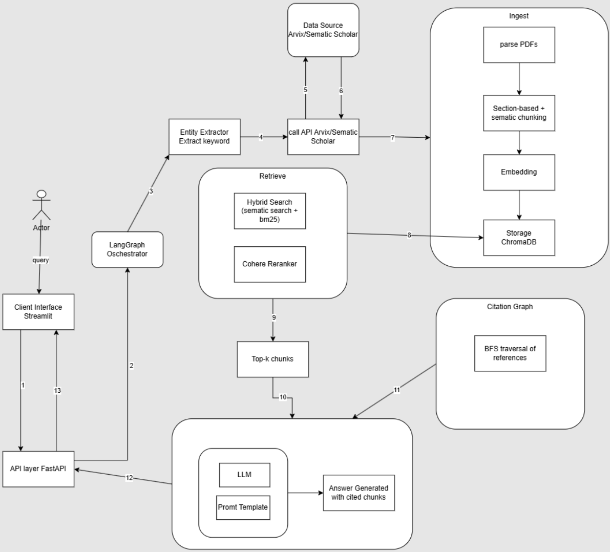
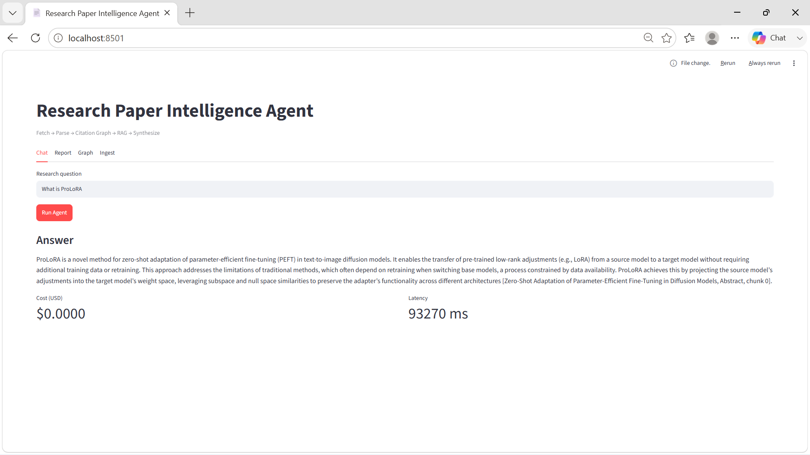
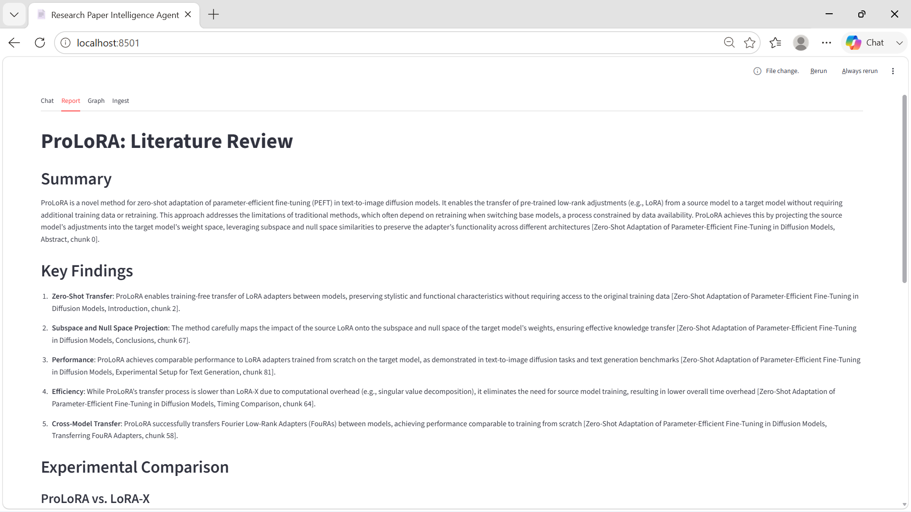
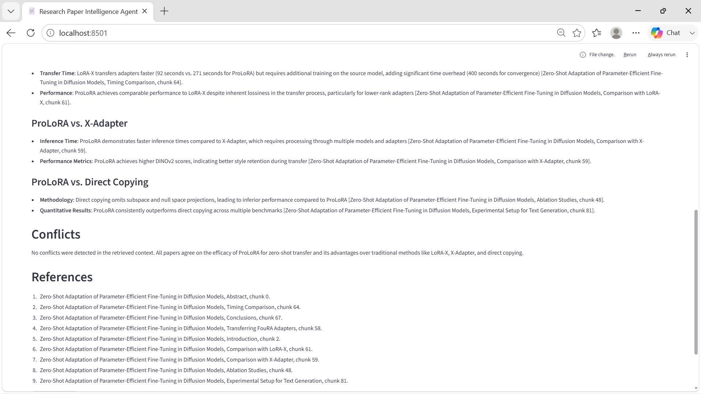
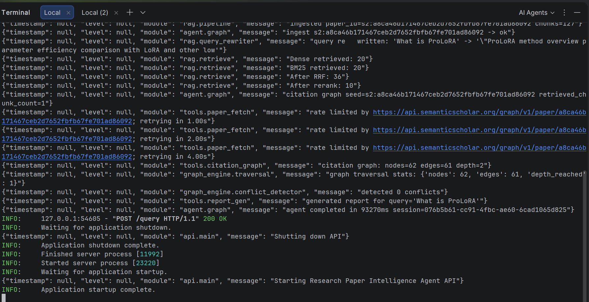

# Research Paper Intelligence Agent

Multi-step agent for ML research papers: **fetch → parse → citation graph → RAG → synthesize**.

## Pipeline


## Demo





## Features

- Built a Dockerized, end-to-end multi-step AI agent for ML literature research: fetch papers from Semantic Scholar and arXiv, parse PDFs, index content for RAG, traverse citation graphs, and generate cited research reports.

- Implemented LLM-based entity extraction and query rewriting to transform natural-language questions into technical search terms optimized for paper discovery and retrieval.

- Developed hybrid RAG retrieval by combining dense embeddings, BM25, Reciprocal Rank Fusion, and reranking to surface relevant evidence from research papers.

- Designed heading-aware semantic chunking that preserves mathematical content, theorems, proofs, and tables for more reliable retrieval of technical information.

- Added multi-hop citation graph traversal and benchmark-conflict detection to compare experimental claims across papers.

- Improved reliability with input validation, retry logic, rate limiting, and graceful fallbacks for external APIs and LLM-dependent stages.

- Measured end-to-end request latency and used session-level caching and candidate limits to control repeated work and retrieval cost.

- Exposed the agent through FastAPI endpoints and a Streamlit interface; added health checks, environment-based configuration, structured logging, and LangSmith tracing for workflow observability and debugging.

## Quick Start

```bash
python -m venv .venv
.venv\Scripts\activate   # Windows
pip install -r requirements.txt
copy .env.example .env   # add OPENAI_API_KEY
```

### Run API

```bash
uvicorn api.main:app --reload --port 8000
```

### Run Streamlit UI

```bash
streamlit run frontend/app.py
```

### Ingest papers

```bash
python -m rag.pipeline --query "attention is all you need" --limit 2
```

### Run agent (Python)

```python
from agent.graph import run_agent
result = run_agent("What is ProLoRA")
print(result["final_answer"])
```

## Architecture

```
User Query
    ↓
[fetch] Semantic Scholar + ArXiv
    ↓
[parse_ingest] MathAwareParser → Chunker → ChromaDB
    ↓
[graph_trace] Citation BFS (NetworkX)
    ↓
[synthesize] RAG retrieve → Conflict detect → Report
```

## Project Structure

```
agent/          LangGraph orchestrator, state, memory, prompts
tools/          paper_fetch, math_parser, citation_graph, rag_retrieve, report_gen, rate_limit
rag/            ChromaDB store, embedder, chunker, pipeline
graph_engine/   BFS traversal, conflict detector, visualizer
api/            FastAPI endpoints
frontend/       Streamlit demo
config/         settings, logging
```

## Environment Variables

See `.env.example` for all options. Minimum for demo:

- `OPENAI_API_KEY` — synthesis + query rewrite
- `COHERE_API_KEY` — reranking (optional, falls back to vector order)
- `SEMANTIC_SCHOLAR_API_KEY`

## Docker

```bash
docker build -t paper-agent .
docker run -p 8000:8000 --env-file .env paper-agent
```

